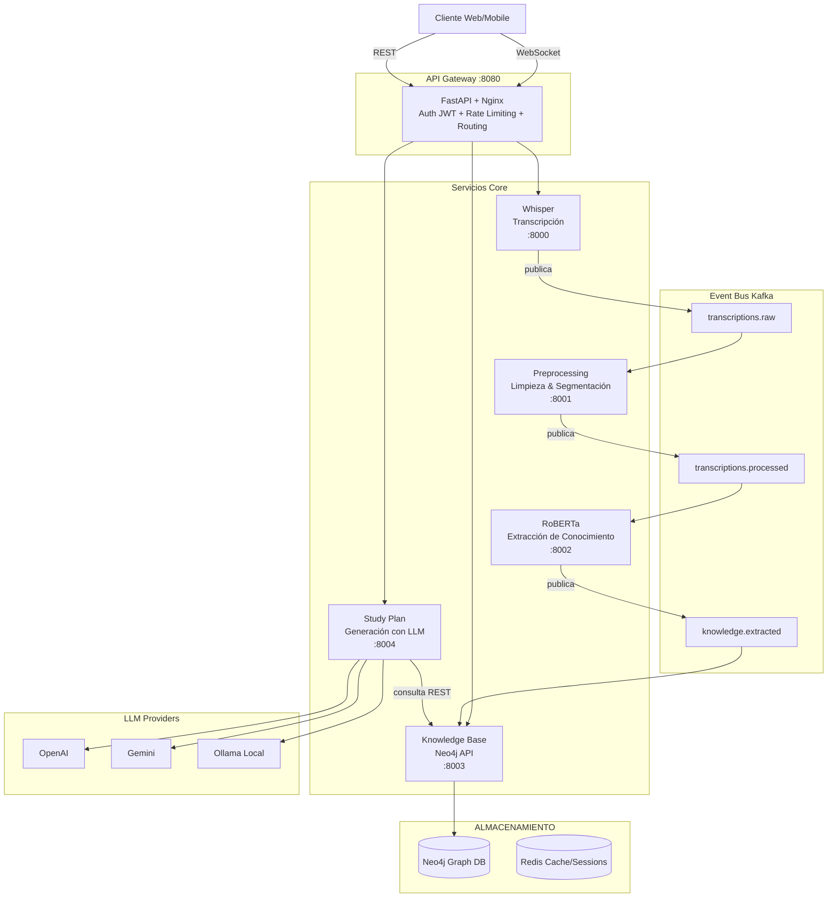
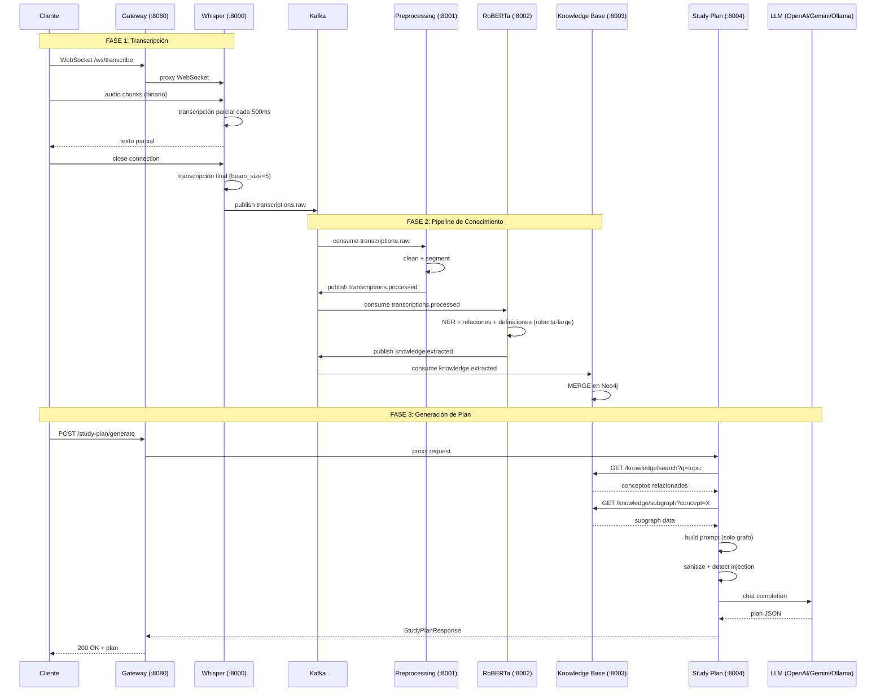

# SAAU — Guía Completa del Proyecto

> **Speech → AI → Augmented Understanding**
> Sistema distribuido de transcripción de audio, extracción de conocimiento y generación de planes de estudio personalizados mediante inteligencia artificial.

---

## Índice

1. [Visión General](#1-visión-general)
2. [Arquitectura del Sistema](#2-arquitectura-del-sistema)
3. [Stack Tecnológico](#3-stack-tecnológico)
4. [Estructura del Proyecto](#4-estructura-del-proyecto)
5. [Flujo de Datos Completo](#5-flujo-de-datos-completo)
6. [Servicios en Profundidad](#6-servicios-en-profundidad)
   - 6.1 [Whisper Transcription Service](#61-whisper-transcription-service-wisper)
   - 6.2 [API Gateway](#62-api-gateway)
   - 6.3 [Preprocessing Service](#63-preprocessing-service)
   - 6.4 [RoBERTa Extraction Service](#64-roberta-extraction-service)
   - 6.5 [Knowledge Base Service](#65-knowledge-base-service)
   - 6.6 [Study Plan Service](#66-study-plan-service)
7. [Shared Libraries](#7-shared-libraries-cross-cutting)
   - 7.1 [Kafka Event Bus](#71-kafka-event-bus)
   - 7.2 [Eventos Tipados](#72-eventos-tipados)
   - 7.3 [Seguridad](#73-seguridad)
8. [Patrones de Comunicación](#8-patrones-de-comunicación)
9. [Base de Datos (Neo4j)](#9-base-de-datos-neo4j)
10. [Decisiones Técnicas](#10-decisiones-técnicas)
11. [Seguridad](#11-seguridad)
12. [Despliegue y Operación](#12-despliegue-y-operación)
13. [Observabilidad](#13-observabilidad)
14. [Estrategia de Costos LLM](#14-estrategia-de-costos-llm)

---

## 1. Visión General

**SAAU** es una plataforma distribuida que transforma audio en planes de estudio estructurados. El pipeline completo consta de:

1. **Transcripción** de audio en tiempo real vía WebSocket usando **Faster-Whisper** (GPU)
2. **Limpieza y segmentación** del texto transcrito
3. **Extracción de conocimiento** usando **RoBERTa** (NER, relaciones, definiciones)
4. **Almacenamiento en grafo** **Neo4j** (conceptos, definiciones, relaciones)
5. **Generación de planes de estudio** usando **LLMs** (OpenAI, Gemini u Ollama local)


El sistema se divide en dos directorios principales:
- **`wisper/`** — Servicio de transcripción preexistente, construido con Clean Architecture
- **`saau/`** — Sistema distribuido completo con 6 microservicios + infraestructura

---

## 2. Arquitectura del Sistema

### 2.1 Diagrama General



### 2.2 Principios Arquitectónicos

| Principio | Aplicación en SAAU |
|-----------|-------------------|
| **Microservicios** | Cada servicio tiene su propio `Dockerfile`, dependencias (`pyproject.toml`), ciclo de vida y escalamiento independiente |
| **Event-Driven Architecture** | Comunicación asíncrona mediante Kafka con 4 topics. Los servicios se acoplan por eventos, no por APIs directas |
| **Clean Architecture** | El servicio `wisper/` implementa dependencias invertidas: el dominio no sabe nada de infraestructura |
| **Stateless** | Ningún servicio guarda estado en disco. Sesiones en memoria (Redis), conocimiento en Neo4j, eventos en Kafka |
| **Defense in Depth** | Múltiples capas de seguridad: WAF (Nginx) → Gateway (auth + rate limit) → Servicio (sanitización) → DB (queries parametrizadas) |
| **Principio de Mínimo Conocimiento** | El servicio Study Plan SOLO recibe datos del grafo de conocimiento, NUNCA los transcripts crudos. Esto previene prompt injection |
| **IoC Manual** | Whisper usa inyección de dependencias manual (sin frameworks DI) para mantener simplicidad y control explícito |

### 2.3 Modelo de Comunicación

| Patrón | Tecnología | Uso |
|--------|-----------|-----|
| **Async Event-Driven** | Kafka | Toda comunicación entre servicios (Whisper → Preprocessing → RoBERTa → KB) |
| **Sync REST** | HTTP/JSON | API Gateway → Servicios internos, Study Plan → Knowledge Base |
| **Streaming Bidireccional** | WebSocket | Cliente → Whisper para envío de audio y recepción de transcripciones parciales |
| **Sync Response** | REST/JSON | API Gateway → Cliente |

---

## 3. Stack Tecnológico

| Capa | Tecnología | Versión |
|------|-----------|---------|
| **Lenguaje** | Python | 3.12+ |
| **API Framework** | FastAPI + Uvicorn | — |
| **Transcripción** | Faster-Whisper (large-v3) | GPU, float16 |
| **NLP** | HuggingFace Transformers (roberta-large) | PyTorch |
| **Graph DB** | Neo4j | 5.x Enterprise (APOC + GDS) |
| **Event Bus** | Apache Kafka (Confluent CP) | 7.6.1 |
| **Cache / Sesiones** | Redis | 7 (Alpine, append-only) |
| **LLM Cloud** | OpenAI GPT-4o / Gemini 1.5 Flash | — |
| **LLM Local** | Llama 3 / Mistral (Ollama) | — |
| **Proxy** | Nginx | con SSL, rate limiting |
| **Contenedores** | Docker + Docker Compose | — |
| **Observabilidad** | Prometheus + Grafana + Loki | — |
| **Testing** | pytest + pytest-asyncio + hypothesis | — |
| **Logging** | structlog (JSON estructurado) | — |

---

## 4. Estructura del Proyecto

```
integrador9/
│
├── wisper/                         # [EXISTENTE] Servicio de Transcripción
│   ├── src/
│   │   ├── main.py                 # FastAPI app factory + lifespan
│   │   ├── domain/                 # ─── Clean Architecture ───
│   │   │   ├── entities/
│   │   │   │   └── transcription.py      # Transcription, TranscriptionEvent, enums
│   │   │   ├── repositories/
│   │   │   │   ├── session_repository.py       # Interfaz ABC
│   │   │   │   └── transcription_repository.py # Interfaz ABC
│   │   │   └── services/
│   │   │       ├── transcriber.py              # Interfaz ABC
│   │   │       └── event_publisher.py          # Interfaz ABC
│   │   ├── application/             # Casos de uso
│   │   │   ├── dto/                 # DTOs de entrada/salida
│   │   │   └── use_cases/
│   │   │       ├── start_session.py
│   │   │       ├── process_audio_chunk.py
│   │   │       └── finalize_transcription.py
│   │   ├── infrastructure/          # Implementaciones concretas
│   │   │   ├── config/settings.py   # Pydantic Settings
│   │   │   ├── di/container.py      # IoC Container manual
│   │   │   ├── logging/setup.py     # Structlog JSON config
│   │   │   ├── redis/
│   │   │   │   ├── redis_stream_publisher.py
│   │   │   │   └── in_memory_session_repository.py
│   │   │   ├── speech/
│   │   │   │   └── faster_whisper_adapter.py   # 190 líneas
│   │   │   └── websocket/
│   │   │       └── connection_manager.py       # 161 líneas
│   │   └── presentation/
│   │       ├── health/health_routes.py
│   │       └── websocket/transcription_ws.py   # Manejador WS
│   ├── tests/
│   │   ├── unit/
│   │   │   ├── domain/test_transcription.py
│   │   │   └── application/test_use_cases.py
│   │   └── integration/
│   │       ├── test_websocket_handler.py
│   │       ├── test_redis_publisher.py
│   │       └── test_health_routes.py
│   └── Dockerfile / docker-compose.yml
│
└── saau/                            # [NUEVO] Sistema Distribuido
    ├── gateway/                     # API Gateway (:8080)
    │   ├── src/main.py              # Enrutamiento, auth, rate limit
    │   ├── src/config.py            # Pydantic Settings
    │   ├── nginx/nginx.conf         # Nginx con SSL + rate limiting
    │   └── Dockerfile
    │
    ├── preprocessing/               # Text Preprocessing (:8001)
    │   ├── src/main.py              # TextCleaner + ChunkSegmenter + Kafka
    │   └── src/config.py
    │
    ├── roberta-extraction/          # Knowledge Extraction (:8002)
    │   ├── src/main.py              # RelationExtractor + NER + Kafka
    │   └── src/config.py
    │
    ├── knowledge-base/              # Neo4j Graph Service (:8003)
    │   ├── src/main.py              # GraphManager (CRUD + subgraph)
    │   ├── src/config.py
    │   └── cypher/init_schema.cypher # Schema Neo4j
    │
    ├── study-plan/                  # LLM Study Plan (:8004)
    │   ├── src/main.py              # LLMClient + PromptManager + Service
    │   └── src/config.py
    │
    ├── shared/                      # Librerías Compartidas
    │   ├── messaging/
    │   │   ├── kafka_client.py      # KafkaEventBus (producer + consumer)
    │   │   └── events.py            # Todos los eventos tipados como dataclasses
    │   └── security/
    │       ├── auth.py              # JWTAuth + require_role
    │       ├── rate_limiter.py      # TokenBucketRateLimiter (Redis) + InMemory fallback
    │       ├── sanitizer.py         # InputSanitizer (XSS + prompt injection + graph)
    │       └── encryption.py        # FieldEncryptor (Fernet + PBKDF2)
    │
    ├── whisper-enhancements/
    │   └── quality_validator.py     # Validación de calidad de transcripción
    │
    ├── scripts/
    │   └── init-topics.sh           # Inicialización de topics Kafka
    │
    ├── grafana/datasources/
    │   └── prometheus.yml           # Datasources para Grafana
    │
    ├── docker-compose.yml           # 14 servicios orquestados
    ├── prometheus.yml               # Config Prometheus
    ├── ARCHITECTURE.md              # Documentación de arquitectura
    ├── DOCUMENTATION.md             # Documentación técnica en español
    ├── COST_ANALYSIS.md             # Análisis de costos LLM
    ├── SECURITY_AUDIT.md            # Auditoría de vulnerabilidades
    └── .env.example                 # Template de variables de entorno
```

---

## 5. Flujo de Datos Completo

### Paso 1: Transcripción de Audio (Whisper)

```
Cliente ──[WebSocket]──▶ Gateway ──[proxy]──▶ Whisper ──▶ Redis Streams / Kafka
```

1. Cliente abre WebSocket en `/ws/transcribe` autenticado con JWT
2. Envía mensaje `StartSession` con `user_id` y `language`
3. `StartSessionUseCase` crea entidad `Transcription` en `InMemorySessionRepository`
4. Cliente envía chunks de audio binario (~500ms de intervalo)
5. `ProcessAudioChunkUseCase`:
   - Valida que la sesión existe y está activa
   - Valida tamaño del chunk (máx 128KB) y buffer total (máx 50MB)
   - Acumula chunks en buffer
   - Cada ~500ms ejecuta transcripción parcial con `FasterWhisperAdapter`
   - `FasterWhisperAdapter` usa `ThreadPoolExecutor` para no bloquear el event loop asyncio
   - El adaptador decodifica audio con `soundfile` o `ffmpeg`, lo resamplea a 16kHz mono, y llama a Faster-Whisper
   - Las transcripciones parciales se envían de vuelta al cliente y se publican a Redis Streams
6. Cliente cierra conexión → `FinalizeTranscriptionUseCase`:
   - Transcribe el buffer completo con mayor precisión (beam_size=5, word_timestamps=True)
   - Marca la sesión como `FINALIZED`
   - Publica resultado final a Redis Streams y Kafka topic `transcriptions.raw`

**Evento publicado en `transcriptions.raw`:**
```json
{
  "event_id": "uuid",
  "session_id": "abc-123",
  "user_id": "student1",
  "timestamp": "2026-06-26T12:00:00+00:00",
  "language": "es",
  "text": "El transformer es una arquitectura de redes neuronales...",
  "confidence": 0.95,
  "language_confidence": 0.99
}
```

### Paso 2: Preprocesamiento de Texto

```
Kafka[transcriptions.raw] ──▶ Preprocessing Service ──▶ Kafka[transcriptions.processed]
```

1. `PreprocessingService.handle_raw_transcript()` recibe el evento de Kafka
2. `TextCleaner.clean()` aplica:
   - `InputSanitizer.sanitize_transcript()` — bloquea XSS, inyección, normaliza Unicode
   - Elimina marcadores de audio: `[música]`, `(aplausos)` vía regex
   - Elimina palabras muletilla: um, uh, like, o sea, you know, etc.
   - Elimina repeticiones inmediatas: "el el el transformer" → "el transformer"
   - Normaliza espacios múltiples
3. Si el texto queda vacío, descarta el evento
4. `ChunkSegmenter.segment()` divide en fragmentos de máx 512 tokens (~384 palabras), mín 50:
   - Divide por oraciones con regex `(?<=[.!?])\s+`
   - Agrupa oraciones hasta alcanzar el límite de tokens
   - Cada chunk se identifica con un hash
5. Publica a Kafka topic `transcriptions.processed`

### Paso 3: Extracción de Conocimiento (RoBERTa)

```
Kafka[transcriptions.processed] ──▶ RoBERTa Extraction Service ──▶ Kafka[knowledge.extracted]
```

1. `ExtractionService.handle_processed_chunk()` recibe cada chunk
2. `RelationExtractor.extract_concepts()`:
   - Carga modelo `roberta-large` con pipeline HuggingFace NER
   - Ejecuta en `ThreadPoolExecutor` para no bloquear asyncio
   - Filtra entidades con confianza >= 0.7 (configurable via `CONFIDENCE_THRESHOLD`)
   - Deduplica por nombre en minúsculas
3. `extract_relationships()`:
   - Busca co-ocurrencias de conceptos en ventanas de 100 caracteres
   - Relación tipo `co_occurs_with` con peso = promedio de confianzas
4. `extract_definitions()`:
   - Detecta patrones como "X is a Y", "X is an Y" con regex
   - Confianza de la definición = confianza del concepto * 0.9
5. Publica a Kafka topic `knowledge.extracted`

### Paso 4: Almacenamiento en Grafo (Neo4j)

```
Kafka[knowledge.extracted] ──▶ Knowledge Base Service ──▶ Neo4j
```

1. `GraphManager.ingest_extracted()` procesa cada evento `KnowledgeExtractedEvent`
2. Crea nodo `:Transcript` con `MERGE` (idempotente)
3. Para cada concepto: `MERGE (:Concept {name})` con `SET` de propiedades (type, confidence, updated_at). Crea relación `EXTRACTED_FROM` hacia el transcript
4. Para cada definición: `MERGE (:Definition {text})` y relación `HAS_DEFINITION`
5. Para cada relación: `MERGE (s)-[:RELATED_TO]->(t)` con tipo dinámico y weight
6. Todos los inputs pasan por `InputSanitizer.sanitize_text()` antes de escribir
7. Cada nodo guarda `updated_at` con `datetime()` de Neo4j

### Paso 5: Generación de Plan de Estudio

```
Cliente ──[REST POST]──▶ Gateway ──[proxy]──▶ Study Plan ──[REST]──▶ Knowledge Base ──[LLM]──▶ Plan
```

1. Cliente envía `POST /study-plan/generate` con `topic`, `difficulty`, `duration_hours`
2. Gateway valida JWT, aplica rate limiting, redirige a Study Plan Service
3. `StudyPlanService.generate_plan()`:
   a. **Consulta KB**: busca conceptos relacionados en `/knowledge/search?q=topic`
   b. **Obtiene subgrafos**: para los top 5 conceptos, llama `/knowledge/subgraph?concept=X&depth=2`
   c. **Construye prompt**: SOLO con datos del grafo (nodos, definiciones, relaciones) — NUNCA texto crudo
   d. **Sanitiza prompt**: `InputSanitizer.sanitize_text()` + `block_prompt_injection()`
   e. **Envía a LLM**: `LLMClient.generate()` que enruta a OpenAI, Gemini u Ollama según configuración
   f. **Parsea respuesta**: valida que sea JSON válido, construye `StudyPlanResponse`
   g. **Retorna**: plan estructurado con módulos, sesiones, evaluaciones

**Regla crítica de seguridad:** El prompt del LLM contiene exclusivamente datos del grafo de conocimiento (conceptos, definiciones, relaciones). Nunca incluye el texto original de la transcripción. Esto previene:
- Prompt injection desde el audio original
- Fugas de información sensible
- Dependencia del LLM del texto crudo

---

## 6. Servicios en Profundidad

### 6.1 Whisper Transcription Service (`wisper/`)

**Puerto:** 8000
**Arquitectura:** Clean Architecture (Domain-Driven)

#### Capas

```
┌─────────────────────────────────────────────────────────────┐
│                    PRESENTATION LAYER                        │
│  Websocket Handler (transcription_ws.py) + Health Routes     │
├─────────────────────────────────────────────────────────────┤
│                    INFRASTRUCTURE LAYER                       │
│  FasterWhisperAdapter │ RedisStreamPublisher │ ConnectionManager │
│  InMemorySessionRepo  │ Settings │ Logging │ IoC Container    │
├─────────────────────────────────────────────────────────────┤
│                    APPLICATION LAYER                          │
│  StartSessionUseCase │ ProcessAudioChunkUseCase              │
│                        FinalizeTranscriptionUseCase           │
├─────────────────────────────────────────────────────────────┤
│                    DOMAIN LAYER                               │
│  Entities: Transcription, TranscriptionEvent, Enums          │
│  Repository Interfaces: SessionRepository,                   │
│    TranscriptionRepository                                   │
│  Service Interfaces: Transcriber, EventPublisher             │
└─────────────────────────────────────────────────────────────┘
```

#### Flujo de Dependencias (Dependency Inversion)

```
Domain (entidades + interfaces) ←── Application (use cases) ←── Infrastructure (implementaciones) ←── Presentation (rutas)
```

- El dominio NO importa nada de application, infrastructure ni presentation
- Las interfaces están en domain/, las implementaciones en infrastructure/
- El `Container` (IoC manual) en infrastructure/di/ conecta todo

#### FasterWhisperAdapter (`infrastructure/speech/faster_whisper_adapter.py`)

- Implementa `Transcriber` (interfaz en domain/)
- Usa `ThreadPoolExecutor` para ejecutar Whisper en hilos separados (no bloquea el event loop)
- `load_model()`: carga modelo en `ThreadPoolExecutor`
- `transcribe_partial()`: beam_size=3, best_of=3, VAD filter activo
- `transcribe_final()`: beam_size=5, best_of=5, word_timestamps=True, mayor precisión
- `_decode_audio()`: intenta `soundfile` primero, fallback a `ffmpeg` para formatos no soportados (WebM, etc.)
- `_resample()`: interpolación lineal si sample rate != 16kHz

#### ConnectionManager (`infrastructure/websocket/connection_manager.py`)

- Mapa `dict[str, WebSocketConnection]` con `asyncio.Lock` para thread-safety
- `WebSocketConnection`: wrapper sobre WebSocket con tracking de `last_activity_at`
- `cleanup_stale()`: tarea en background que cierra conexiones inactivas (>5 min)
- `broadcast_json()` y `send_to_session()` para comunicación con clientes

#### Control de Flujo de Audio

- Chunk máximo: 128KB (`MAX_CHUNK_SIZE_BYTES`)
- Buffer máximo por sesión: 50MB (`max_buffer_bytes`)
- Intervalo de transcripción parcial: 500ms (`CHUNK_INTERVAL_MS`)
- Timeout de sesión: 300 segundos (`SESSION_TIMEOUT_SECONDS`)
- Sesiones máximas simultáneas: 100 (`MAX_SESSIONS`)

### 6.2 API Gateway

**Puerto:** 8080
**Archivo:** `saau/gateway/src/main.py`

#### Responsabilidades

1. **Autenticación JWT** — `POST /auth/login` genera token HS256 con 1 hora de expiración
2. **Rate Limiting** — Token Bucket en Redis, 60 requests/minuto por usuario
3. **Proxy reverso** — Redirige peticiones a servicios internos según ruta
4. **Nginx** — SSL termination, rate limiting layer, security headers

#### Endpoints

| Endpoint | Método | Auth | Rate Limit | Proxy a |
|----------|--------|------|------------|---------|
| `/health` | GET | No | No | — |
| `/auth/login` | POST | No | No | — |
| `/whisper/transcribe` | POST | JWT | 60/min | Whisper :8000 |
| `/study-plan/generate` | POST | JWT | 60/min | Study Plan :8004 |
| `/knowledge/subgraph` | GET | JWT | 60/min | KB :8003 |
| `/knowledge/search` | GET | JWT | 60/min | KB :8003 |

#### Nginx (`gateway/nginx/nginx.conf`)

- SSL con TLS 1.2/1.3, ciphers restrictivos
- Rate limiting con `limit_req_zone` (60r/m, burst configurable)
- Security headers: X-Frame-Options, HSTS, CSP, X-XSS-Protection, Referrer-Policy, Permissions-Policy
- WebSocket support con `proxy_set_header Upgrade` y `Connection: upgrade`
- Preprocessing restringido a red interna (allow 10.0.0.0/8, 172.16.0.0/12)
- Logging en formato JSON estructurado

### 6.3 Preprocessing Service

**Puerto:** 8001
**Archivo:** `saau/preprocessing/src/main.py`

#### TextCleaner

Elimina en orden:
1. Sanitización (XSS + inyección) via `InputSanitizer`
2. Marcadores `[...]` y `(...)` (comunes en subtítulos)
3. Repeticiones inmediatas: `(\b\w+\b)(\s+\1\b){2,}` → primera ocurrencia
4. Muletillas: 17 palabras configuradas como set (um, uh, like, you know, etc.)
5. Espacios múltiples → simple

#### ChunkSegmenter

- Divide por oraciones con regex lookbehind
- Agrupa hasta `max_tokens` (512 default) o mínimo `min_tokens` (50 default)
- Cuenta tokens como palabras separadas por espacios (aproximación)

#### Kafka Consumer/Producer

- Consume de `transcriptions.raw` con group_id `preprocessing-group`
- Publica a `transcriptions.processed`

### 6.4 RoBERTa Extraction Service

**Puerto:** 8002
**Archivo:** `saau/roberta-extraction/src/main.py`

#### RelationExtractor

- Carga `roberta-large` con pipeline `"ner"`, aggregation_strategy="simple"
- `load()` se ejecuta en `ThreadPoolExecutor` para no bloquear
- `extract_concepts()`: procesa en lotes de 8 (configurable), filtra por `CONFIDENCE_THRESHOLD >= 0.7`
- `extract_relationships()`: co-ocurrencia en ventana de 100 caracteres, deduplica pares
- `extract_definitions()`: patrones regex `"X is a Y"`, `"X is an Y"`
- GPU requerida (CUDA), con fallback a CPU si no disponible

### 6.5 Knowledge Base Service

**Puerto:** 8003
**Archivo:** `saau/knowledge-base/src/main.py`

#### GraphManager

- Usa `neo4j.AsyncGraphDatabase` con pool de conexiones
- `connect()`: verifica conectividad, máximo 3600s de vida de conexión
- **Operaciones atómicas con MERGE** (idempotentes):
  - `upsert_concept()`: MERGE por `name`, SET type/confidence/updated_at. Link a Transcript
  - `upsert_definition()`: MERGE por `text`, SET confidence/updated_at. Link HAS_DEFINITION
  - `upsert_relationship()`: MATCH source/target, MERGE relación con tipo dinámico
- **Consultas**:
  - `get_subgraph()`: recorrido de grafo hasta `depth` niveles con `[*1..$depth]`
  - `search()`: CONTAINS sobre `name` y `type`, con LIMIT
- `ingest_extracted()`: orquesta todas las operaciones para un evento completo

#### Esquema Neo4j (`cypher/init_schema.cypher`)

```cypher
// Constraints (unicidad)
Concept.name IS UNIQUE
Transcript.id IS UNIQUE
Definition.text IS UNIQUE

// Indexes (rendimiento)
Concept(name)
Concept(type)
Definition(text)

// Full-text index
FULLTEXT INDEX concept_search ON (Concept.name, Concept.type)

// Nodos
(:Concept {name, type, confidence, updated_at, provenance})
(:Definition {text, confidence, updated_at})
(:Transcript {id, created_at, updated_at})

// Relaciones
(:Concept)-[:HAS_DEFINITION]->(:Definition)
(:Concept)-[:RELATED_TO {type, weight, updated_at}]->(:Concept)
(:Concept)-[:EXTRACTED_FROM]->(:Transcript)
```

### 6.6 Study Plan Service

**Puerto:** 8004
**Archivo:** `saau/study-plan/src/main.py`

#### LLMClient

- Soporta 3 providers: `openai`, `gemini`, `local`
- **Cloud**: usa `openai.AsyncOpenAI` con `response_format={"type": "json_object"}`
- **Local**: llama a Ollama API en `{LOCAL_LLM_URL}/api/chat` con HTTP POST
- Timeout: 120s para local, default para cloud
- Temperatura: 0.3 (baja para consistencia)
- `is_available()`: verifica que las credenciales/config estén presentes

#### PromptManager

- El `SYSTEM_PROMPT_TEMPLATE` incluye reglas estrictas:
  - Solo usar conceptos del grafo proporcionado
  - Output exclusivamente JSON válido
  - Duración no debe exceder lo solicitado
  - Cada sesión debe referenciar conceptos específicos
- `build_system_prompt()`: formatea concepts_json, definitions_json, relationships_json
- `build_user_prompt()`: construye prompt con topic, difficulty, duration, focus_areas + schema JSON

#### Security Check (crítico)

```python
sanitized_system = InputSanitizer.sanitize_text(system_prompt)
sanitized_user = InputSanitizer.sanitize_text(user_prompt)

if InputSanitizer.block_prompt_injection(sanitized_system) or \
   InputSanitizer.block_prompt_injection(sanitized_user):
    raise HTTPException(status_code=400, detail="Prompt injection detected")
```

---

## 7. Shared Libraries (Cross-Cutting)

### 7.1 Kafka Event Bus (`shared/messaging/kafka_client.py`)

Clase `KafkaEventBus` que encapsula `AIOKafkaProducer` y `AIOKafkaConsumer`:

```python
class KafkaEventBus:
    async def start_producer(self)      # Inicia productor (acks=all, retry 500ms)
    async def publish(self, topic, event)  # Publica evento tipado como JSON
    async def start_consumer(self, topic, group_id, handler)  # Consume en loop infinito
    async def stop(self)                 # Detiene producer + todos los consumers
```

- Serialización: `json.dumps` en producer, `json.loads` en consumer
- Manejo de errores: captura `KafkaError`, log con structlog, relanza
- Los consumers corren como `asyncio.create_task()` dentro del lifespan de FastAPI
- Max request size: 10MB
- Auto commit cada 5 segundos, offset más temprano en inicio

### 7.2 Eventos Tipados (`shared/messaging/events.py`)

Todos los eventos como dataclasses con herencia de `BaseEvent`:

| Clase | Topic | Campos Clave |
|-------|-------|-------------|
| `TranscriptionRawEvent` | `transcriptions.raw` | session_id, user_id, language, text, confidence |
| `TranscriptionProcessedEvent` | `transcriptions.processed` | transcription_id, chunks[] (id, text, token_count) |
| `KnowledgeExtractedEvent` | `knowledge.extracted` | chunk_id, concepts[], definitions[], relationships[] |
| `StudyPlanGeneratedEvent` | `study_plans.generated` | plan_id, user_id, topic, modules[] |

Cada evento hereda: `event_id` (UUID), `timestamp` (ISO 8601), `event_type`, `source_service`.

### 7.3 Seguridad

#### JWTAuth (`shared/security/auth.py`)

- Extiende `fastapi.security.HTTPBearer` (auto-error=False para manejo manual)
- `create_token(user_id, roles, expires_in=3600)`: HS256 con iat/exp
- `verify_token(token)`: decodifica, retorna `AuthPayload` (user_id, roles, exp, iat)
- `__call__()`: middleware que extrae y verifica token del header Authorization
- `require_role()`: verifica roles, 403 si no tiene permiso

#### TokenBucketRateLimiter (`shared/security/rate_limiter.py`)

- Algoritmo: ventana fija por minuto (timestamp // 60)
- Clave: `rate_limit:{user_key}:{current_window}`
- Usa `INCR` + `EXPIRE` en pipeline Redis (atómico)
- `InMemoryRateLimiter`: fallback en memoria con `defaultdict(list)` si Redis no disponible
- Header `Retry-After: 60` en respuestas 429

#### InputSanitizer (`shared/security/sanitizer.py`)

```
sanitize_text()         → XSS blocking + html.escape()
sanitize_transcript()   → sanitize_text() + solo caracteres imprimibles + espacios
block_prompt_injection() → detecta 12 patrones de inyección (ignore instructions, etc.)
sanitize_graph_data()   → sanitize recursivo sobre dicts/lists/strings
validate_json_structure() → validación contra schema Pydantic
```

Patrones bloqueados en `sanitize_text()`:
- `<script>` tags
- `javascript:` protocolo
- Event handlers (`onclick=`, `onerror=`, etc.)
- Templates injection (`{{ }}`, `#{ }`, `` `${ }` ``)

Patrones de prompt injection:
- "ignore all previous instructions"
- "forget everything"
- "you are now"
- "system prompt"
- "override instructions"
- "act as if/though"
- "do not follow"
- etc.

#### FieldEncryptor (`shared/security/encryption.py`)

- `derive_key(password, salt)`: PBKDF2HMAC con SHA-256, 600K iteraciones
- `Fernet` (AES-128-CBC + HMAC-SHA256) para encrypt/decrypt
- Planeado para datos sensibles en reposo

---

## 8. Patrones de Comunicación

### 8.1 Diagrama de Secuencia Completo



### 8.2 Kafka Topics

| Topic | Producer | Consumer | Partición | Data |
|-------|----------|----------|-----------|------|
| `transcriptions.raw` | Whisper | Preprocessing | Por user_id | Texto crudo + metadatos |
| `transcriptions.processed` | Preprocessing | RoBERTa | Por chunk_id | Chunks limpios |
| `knowledge.extracted` | RoBERTa | Knowledge Base | Por chunk_id | Conceptos, definiciones, relaciones |
| `study_plans.generated` | Study Plan | — (futuro) | Por user_id | Planes generados |

Los topics se crean automáticamente (`AUTO_CREATE_TOPICS_ENABLE=true`) o mediante el script `scripts/init-topics.sh`.

### 8.3 REST Endpoints Internos

| Origen → Destino | Endpoint | Propósito |
|-----------------|----------|-----------|
| Gateway → Whisper | `POST /whisper/*` | Proxy transcripción REST |
| Gateway → KB | `GET /knowledge/subgraph?concept=&depth=` | Subgrafo de conocimiento |
| Gateway → KB | `GET /knowledge/search?q=&limit=` | Búsqueda de conceptos |
| Gateway → Study Plan | `POST /study-plan/generate` | Generar plan de estudio |
| Study Plan → KB | `GET /knowledge/subgraph?concept=&depth=2` | Obtener subgrafo para prompt |
| Study Plan → KB | `GET /knowledge/search?q=&limit=5` | Buscar conceptos iniciales |

### 8.4 WebSocket

| Ruta | Origen → Destino | Formato | Propósito |
|------|-----------------|---------|-----------|
| `/ws/transcribe` | Cliente → Whisper | JSON + bytes | Streaming de audio con transcripción en tiempo real |

Mensajes del WebSocket:
- Cliente → Servidor: `{"type": "start", "session_id": "...", "user_id": "...", "language": "es"}`
- Cliente → Servidor: `{"type": "audio", "session_id": "..."}` seguido de bytes de audio
- Servidor → Cliente: `{"type": "partial", "session_id": "...", "text": "...", "is_partial": true}`
- Servidor → Cliente: `{"type": "final", "session_id": "...", "text": "...", "is_partial": false}`

---

## 9. Base de Datos (Neo4j)

### 9.1 Modelo de Grafo

```
┌───────────┐       ┌──────────────┐       ┌──────────────┐
│  Concept  │──────▶│  Definition  │       │  Transcript  │
│           │  HAS_DEFINITION │              │              │
│ name      │       └──────────────┘       │ id           │
│ type      │                               │ created_at   │
│ confidence│       ┌──────────────┐       │ updated_at   │
│ updated_at│──────▶│  Concept     │       └──────────────┘
│ provenance│  RELATED_TO        │                  ▲
└───────────┘       │ (type,      │                  │
                     │  weight,    │                  │
                     │  updated_at)│                  │
                     └──────────────┘       ┌──────────────┐
                                             │  EXTRACTED_  │
                                             │  FROM        │
                                             └──────────────┘
```

### 9.2 Constraints y Performance

- **UNIQUE** en: `Concept.name`, `Transcript.id`, `Definition.text`
- **INDEX** en: `Concept(name)`, `Concept(type)`, `Definition(text)`
- **FULLTEXT INDEX** en: `Concept(name, type)` para búsqueda textual

### 9.3 Patrones de Consulta

```cypher
// Subgrafo completo alrededor de un concepto
MATCH path = (c:Concept {name: $concept_name})-[:RELATED_TO|HAS_DEFINITION*1..$depth]-(related)
RETURN nodes(path) as nodes, relationships(path) as rels

// Búsqueda textual de conceptos
MATCH (c:Concept)
WHERE c.name CONTAINS $query OR c.type CONTAINS $query
RETURN c, labels(c) as labels
LIMIT $limit

// Cadena de definiciones
MATCH (c:Concept {name: $concept})-[:HAS_DEFINITION]->(d:Definition)
RETURN c.name, d.text
```

---

## 10. Decisiones Técnicas

### 10.1 Clean Architecture para Whisper

El servicio `wisper/` usa Clean Architecture porque maneja lógica de dominio compleja (transcripción con estados, buffers, sesiones). Las interfaces en `domain/` permiten cambiar implementaciones (ej: cambiar Redis por otra DB) sin afectar los casos de uso.

Los servicios nuevos en `saau/` usan una estructura más simple porque son esencialmente pipelines: reciben datos, los transforman y los publican. No tienen lógica de dominio compleja.

### 10.2 Kafka como Event Bus vs. RabbitMQ

Se eligió Kafka sobre RabbitMQ por:
- **Replayabilidad**: los consumers pueden resetear offsets y reprocesar eventos
- **Throughput**: Kafka maneja mejor alto throughput de mensajes (útil para transcripciones)
- **Particionamiento**: partición por user_id permite procesamiento ordenado por usuario
- **Ecosistema Confluent**: Schema Registry, Kafka Connect, etc.

### 10.3 Redis Streams (Whisper) + Kafka (SAAU)

Whisper usa Redis Streams como capa adicional antes de Kafka porque:
- Redis está siempre disponible localmente (baja latencia)
- Los streams de Redis tienen consumer groups similares a Kafka
- El gateway y el speech service comparten Redis para sesiones y rate limiting

### 10.4 ThreadPoolExecutor para Modelos GPU

Whisper y RoBERTa cargan modelos GPU que son síncronos (no asyncio). Se usa `ThreadPoolExecutor` para ejecutar la inferencia en hilos separados, evitando bloquear el event loop de asyncio. El pool tiene `max_workers=1` para GPU (solo una inferencia a la vez).

### 10.5 Manual IoC Container vs. DI Framework

El `Container` en `wisper/src/infrastructure/di/container.py` es manual (sin usar Dependency Injector, FastAPI DI, etc.). Decisión consciente:
- Simplicidad: el container tiene ~110 líneas y es explícito
- Control: cada dependencia se crea y configura manualmente
- Sin magic: no hay decoradores ocultos ni resolución automática

### 10.6 Solo Grafo al LLM (Nunca Texto Crudo)

Decisión de seguridad fundamental: el Study Plan Service construye prompts exclusivamente con datos del grafo de conocimiento. Esto:
- Previene **prompt injection** desde el audio original
- Elimina la posibilidad de que el LLM regurgite información sensible
- Fuerza al LLM a basarse en conocimiento estructurado, no en texto libre

### 10.7 Estrategia Multi-Modelo LLM

El sistema soporta 3 providers intercambiables:
- **OpenAI GPT-4o**: calidad máxima, costo alto (~$12K/año)
- **Gemini 1.5 Flash**: buena calidad, costo mínimo (~$36/año)
- **Local Ollama**: sin costo operacional, requiere GPU dedicada

La recomendación es **híbrido**: 80% local (Llama 3 8B en RTX 4090) + 20% Gemini Flash para casos complejos.

### 10.8 Umbral de Confianza 0.7 para KB

Todo concepto con confianza < 0.7 se descarta antes de escribir en Neo4j. Esto previene **knowledge base poisoning** (envenenamiento de la base de conocimiento con datos incorrectos o maliciosos).

---

## 11. Seguridad

### 11.1 Capas de Defensa

```
Cliente → Nginx (WAF + SSL + Rate Limit + Security Headers)
       → API Gateway (JWT Auth + Token Bucket Rate Limiter)
         → Servicio (InputSanitizer + Prompt Injection Detection)
           → Base de Datos (Queries parametrizadas + Constraints)
```

### 11.2 Autenticación

- JWT con algoritmo HS256, expiración 1 hora
- Payload: `{user_id, roles: ["user"], iat, exp}`
- Endpoints protegidos excepto `/health` y `/auth/login`
- `jwtauth` implementado como `HTTPBearer` de FastAPI

### 11.3 Rate Limiting

- Algoritmo: Token Bucket con ventana fija de 1 minuto
- Backend: Redis con fallback a InMemory
- Default: 60 requests/minuto por usuario
- Header `Retry-After: 60` en respuestas 429

### 11.4 Sanitización de Inputs

- Bloqueo de XSS: `<script>`, `javascript:`, event handlers, template injection
- Normalización Unicode (NFKC) antes de pattern matching
- Límite de 100K caracteres por input
- Sanitización recursiva para datos del grafo

### 11.5 Prevención de Prompt Injection

- 12 patrones de inyección detectados vía regex
- Normalización a minúsculas antes del matching
- El LLM nunca recibe texto crudo (solo grafo)
- Si se detecta inyección: HTTP 400

### 11.6 Headers de Seguridad (Nginx)

```
X-Frame-Options: DENY
X-Content-Type-Options: nosniff
X-XSS-Protection: 1; mode=block
Strict-Transport-Security: max-age=31536000; includeSubDomains
Content-Security-Policy: default-src 'self'; script-src 'none'; style-src 'none';
Referrer-Policy: strict-origin-when-cross-origin
Permissions-Policy: geolocation=(), microphone=(), camera=()
```

### 11.7 Contenedores

- Usuarios no-root dedicados (`speech`, `app`, `gateway`)
- `.env` excluido de imágenes Docker (`.dockerignore`)
- Multi-stage builds para imágenes mínimas
- Healthchecks en todos los servicios

---

## 12. Despliegue y Operación

### 12.1 Prerrequisitos

- Docker Desktop 24+ con WSL2
- NVIDIA GPU + CUDA 12.1+ (para Whisper y RoBERTa)
- NVIDIA Container Toolkit (GPU en Docker)
- Python 3.12+ (desarrollo local)

### 12.2 Docker Compose (14 Servicios)

| Servicio | Puerto | Depende de | GPU | Profile |
|----------|--------|-----------|-----|---------|
| `gateway` | 8080 | redis, kafka | No | — |
| `speech-service` | 8000 | redis, kafka | Sí | — |
| `preprocessing` | 8001 | kafka | No | — |
| `roberta-extraction` | 8002 | kafka | Sí | — |
| `knowledge-base` | 8003 | neo4j, kafka | No | — |
| `study-plan` | 8004 | kafka | No | — |
| `ollama` | 11434 | (independiente) | Sí | `local-llm` |
| `neo4j` | 7474, 7687 | — | No | — |
| `kafka` | 9092 | zookeeper | No | — |
| `zookeeper` | 2181 | — | No | — |
| `schema-registry` | 8081 | kafka | No | — |
| `redis` | 6379 | — | No | — |
| `prometheus` | 9090 | — | No | — |
| `grafana` | 3000 | — | No | — |

### 12.3 Comandos Esenciales

```bash
# Iniciar todo
docker compose up -d

# Iniciar con LLM local
docker compose --profile local-llm up -d

# Inicializar topics Kafka
docker compose exec kafka bash /scripts/init-topics.sh

# Ver logs
docker compose logs -f [service]
```

### 12.4 Variables de Entorno Clave

| Variable | Obligatoria | Default | Descripción |
|----------|------------|---------|-------------|
| `JWT_SECRET` | ✅ | — | Secreto de 64+ chars para firmar JWTs |
| `NEO4J_PASSWORD` | ✅ | — | Contraseña de Neo4j |
| `LLM_API_KEY` | Depende | — | API key de OpenAI o Gemini |
| `LLM_PROVIDER` | ❌ | `openai` | `openai`, `gemini` o `local` |
| `WHISPER_MODEL` | ❌ | `large-v3` | Modelo Faster-Whisper |
| `WHISPER_DEVICE` | ❌ | `cuda` | `cuda` o `cpu` |
| `RATE_LIMIT_PER_MIN` | ❌ | `60` | Requests/minuto por usuario |
| `LOG_LEVEL` | ❌ | `INFO` | `DEBUG`, `INFO`, `WARNING`, `ERROR` |

---

## 13. Observabilidad

### 13.1 Logging (structlog)

- Formato JSON estructurado en todas las salidas
- Niveles: DEBUG, INFO, WARNING, ERROR
- Eventos asíncronos con `await logger.ainfo()` (no bloquea event loop)
- Campos comunes: event, service, session_id, user_id, error, exc_info

### 13.2 Métricas (Prometheus + Grafana)

- **Prometheus**: recolección de métricas de todos los servicios
- **Grafana**: dashboards con Prometheus, Neo4j y Loki como datasources
- Plugins instalados: neo4j-datasource

### 13.3 Health Checks

Cada servicio expone:
- `GET /health`: estado general del servicio
- En Whisper: además `GET /ready` (readiness) y `GET /live` (liveness)

### 13.4 Endpoints de Monitoreo

| Herramienta | URL | Credenciales |
|------------|-----|-------------|
| Grafana | http://localhost:3000 | admin / admin (configurable) |
| Prometheus | http://localhost:9090 | — |
| Neo4j Browser | http://localhost:7474 | neo4j / (password configurada) |
| Schema Registry | http://localhost:8081 | — |

---

## 14. Estrategia de Costos LLM

### 14.1 Comparativa de Proveedores

| Proveedor | Modelo | Costo Input/1M tok | Costo Output/1M tok | Costo anual (10K req/día) |
|-----------|--------|-------------------|--------------------|--------------------------|
| OpenAI | GPT-4o | $2.50 | $10.00 | ~$12,150 |
| OpenAI | GPT-4o-mini | $0.15 | $0.60 | ~$729 |
| Gemini | 1.5 Flash | $0.075 | $0.30 | **~$36** |
| Gemini | 1.5 Pro | $1.25 | $5.00 | ~$608 |
| Local | Llama 3 8B | ~$0.00000015 | ~$0.00000015 | ~$888 (electricidad + HW) |

### 14.2 Recomendación: Híbrido

**Fase 1 (lanzamiento):** Gemini 1.5 Flash — ~$36/año
**Fase 2 (escala):** 80% local (Llama 3 8B en RTX 4090) + 20% Gemini Flash (fallback/complejo)
**Costo anual estimado híbrido:** ~$1,032

### 14.3 Configuración

```bash
# .env
LLM_PROVIDER=gemini        # openai | gemini | local
LLM_MODEL=gemini-1.5-flash
LOCAL_LLM_MODEL=llama3     # solo si provider=local
LOCAL_LLM_URL=http://ollama:11434
```

---

## Referencias Rápidas

| Si necesitas... | Ve a... |
|----------------|---------|
| Entender el flujo completo | Este documento (`GUIA_COMPLETA_DEL_PROYECTO.md`) |
| Arquitectura detallada | `saau/ARCHITECTURE.md` |
| Documentación técnica en español | `saau/DOCUMENTATION.md` |
| Vulnerabilidades y plan de fixes | `saau/SECURITY_AUDIT.md` |
| Análisis de costos LLM | `saau/COST_ANALYSIS.md` |
| Inicio rápido | `saau/README.md` y `wisper/README.md` |
| Template de variables de entorno | `saau/.env.example` |
| Schema de Neo4j | `saau/knowledge-base/cypher/init_schema.cypher` |
| Eventos Kafka | `saau/shared/messaging/events.py` |
| Seguridad (auth, rate limit, sanitize) | `saau/shared/security/` |
| Configuración de Prometheus | `saau/prometheus.yml` |
| Configuración de Nginx | `saau/gateway/nginx/nginx.conf` |
| Validación de calidad Whisper | `saau/whisper-enhancements/quality_validator.py` |
| Tests unitarios | `wisper/tests/unit/` |
| Tests de integración | `wisper/tests/integration/` |
