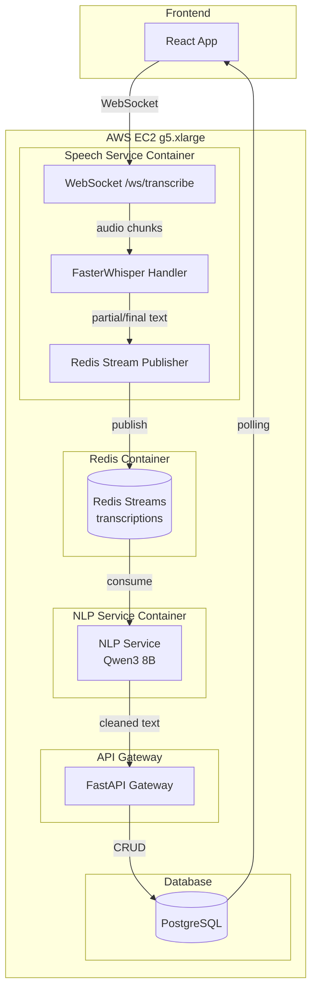
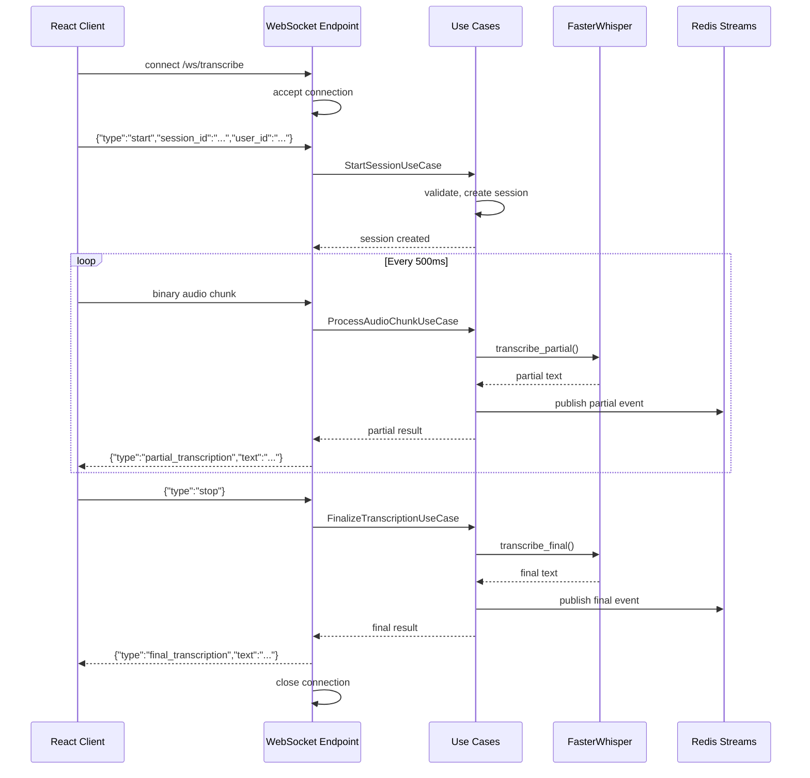
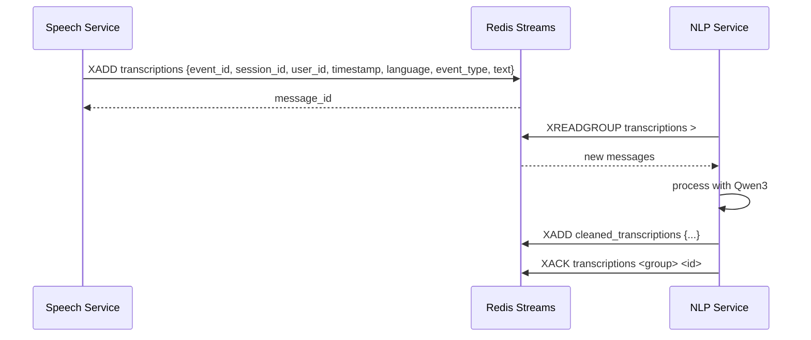
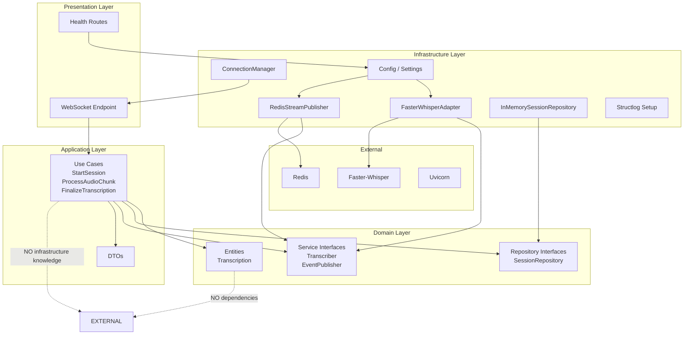
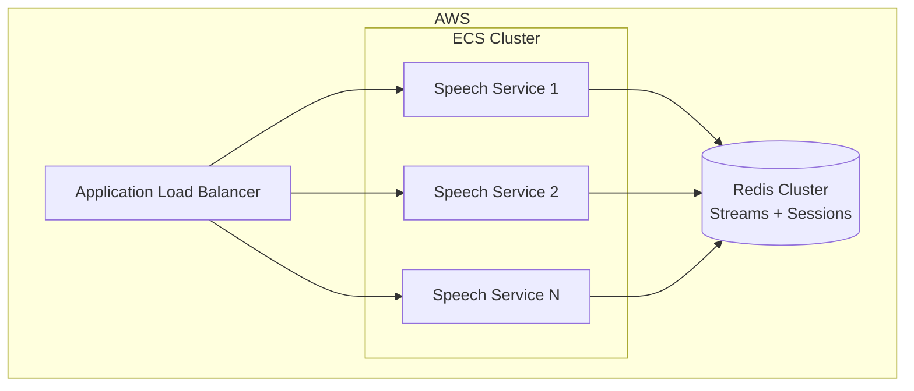

# Speech Service

Microservicio de transcripción de voz a texto en tiempo real, listo para producción. Construido con **Clean Architecture**, **FastAPI**, **Faster-Whisper** y **Redis Streams**.

---

## Tabla de Contenidos

- [Arquitectura](#arquitectura)
- [Stack Tecnológico](#stack-tecnológico)
- [Estructura del Proyecto](#estructura-del-proyecto)
- [Decisiones Arquitectónicas](#decisiones-arquitectónicas)
- [Instalación y Desarrollo Local](#instalación-y-desarrollo-local)
- [Producción AWS](#producción-aws)
- [Docker](#docker)
- [Variables de Entorno](#variables-de-entorno)
- [Protocolo WebSocket](#protocolo-websocket)
- [Redis Streams](#redis-streams)
- [Monitoreo y Observabilidad](#monitoreo-y-observabilidad)
- [Benchmark](#benchmark)
- [Escalabilidad](#escalabilidad)
- [Testing](#testing)

---

## Arquitectura

### Arquitectura General



### Flujo WebSocket



### Flujo Redis Streams



### Dependencias Clean Architecture



---

## Stack Tecnológico

| Componente | Tecnología |
|---|---|
| Lenguaje | Python 3.12 |
| Framework Web | FastAPI |
| ASGI Server | Uvicorn |
| Speech-to-Text | Faster-Whisper |
| Mensajería | Redis Streams (redis-py async) |
| Validación | Pydantic v2 / Pydantic-Settings |
| Logging | Structlog (JSON estructurado) |
| Testing | Pytest + pytest-asyncio + pytest-cov |
| Contenedores | Docker + Docker Compose |
| GPU | NVIDIA A10G (g5.xlarge) |
| Calidad de Código | Ruff + MyPy |

---

## Estructura del Proyecto

```
speech-service/
├── src/
│   ├── domain/
│   │   ├── entities/
│   │   │   └── transcription.py          # Entidad core + eventos
│   │   ├── repositories/
│   │   │   └── session_repository.py     # Interface del repositorio
│   │   └── services/
│   │       ├── transcriber.py            # Interface del transcriber
│   │       └── event_publisher.py        # Interface del publisher
│   │
│   ├── application/
│   │   ├── dto/
│   │   │   └── transcription_dto.py      # Data Transfer Objects
│   │   └── use_cases/
│   │       ├── start_session.py          # Iniciar sesión de transcripción
│   │       ├── process_audio_chunk.py    # Procesar chunk de audio
│   │       └── finalize_transcription.py # Finalizar transcripción
│   │
│   ├── infrastructure/
│   │   ├── speech/
│   │   │   └── faster_whisper_adapter.py # Adaptador Faster-Whisper
│   │   ├── redis/
│   │   │   ├── redis_stream_publisher.py        # Publisher Redis Streams
│   │   │   └── in_memory_session_repository.py  # Repositorio en memoria
│   │   ├── websocket/
│   │   │   └── connection_manager.py     # Gestor de conexiones WebSocket
│   │   ├── config/
│   │   │   └── settings.py               # Configuración (env vars)
│   │   ├── logging/
│   │   │   └── setup.py                  # Configuración Structlog
│   │   └── di/
│   │       └── container.py              # Contenedor IoC
│   │
│   ├── presentation/
│   │   ├── websocket/
│   │   │   └── transcription_ws.py       # Handler WebSocket
│   │   └── health/
│   │       └── health_routes.py          # Health checks
│   │
│   └── main.py                           # App factory
│
├── tests/
│   ├── conftest.py                       # Fixtures compartidos
│   ├── unit/
│   │   ├── domain/
│   │   │   └── test_transcription.py     # Tests entidad
│   │   └── application/
│   │       └── test_use_cases.py         # Tests casos de uso
│   └── integration/
│       ├── test_redis_publisher.py       # Tests Redis
│       ├── test_websocket_handler.py     # Tests WebSocket
│       └── test_health_routes.py         # Tests health
│
├── docker-compose.yml
├── Dockerfile
├── pyproject.toml
├── .env.example
└── README.md
```

---

## Decisiones Arquitectónicas

### 1. Clean Architecture con Dependency Inversion

La capa de **dominio** no importa nada de infraestructura. Las interfaces (`Transcriber`, `TranscriptionEventPublisher`, `SessionRepository`) se definen en dominio, y las implementaciones concretas en infraestructura. Los casos de uso en aplicación dependen solo de interfaces.

### 2. Redis Streams en lugar de PubSub

Redis Streams ofrece:
- Persistencia de mensajes (append-only log)
- Consumer groups para procesamiento distribuido
- Acknowledgment de mensajes
- Replay de mensajes fallidos
- No se pierden mensajes si el consumidor cae

### 3. Whisper en ThreadPoolExecutor

Faster-Whisper es CPU/GPU intensivo. Se ejecuta en un `ThreadPoolExecutor` separado para no bloquear el event loop de asyncio. Esto permite que FastAPI siga aceptando conexiones mientras se procesa audio.

### 4. Buffer de Audio por Sesión

Cada sesión mantiene un buffer acumulativo en memoria. Cuando se supera el intervalo configurado (`CHUNK_INTERVAL_MS`), se envía el buffer completo a Whisper para transcripción parcial. Esto permite transcripciones incrementales con contexto completo.

### 5. In-Memory Session Repository

Para mantener la latencia ultrabaja (<1s), las sesiones activas se almacenan en memoria. Para escalar a múltiples servidores, se migraría a Redis como almacén de sesiones compartido.

### 6. Container IoC Manual

Se usa un contenedor de dependencias manual en lugar de `dependency-injector` para evitar otra dependencia externa y mantener la simplicidad. Sigue el principio de Inversión de Dependencias.

---

## Instalación y Desarrollo Local

### Prerrequisitos

- Python 3.12+
- Redis 7+ (local o Docker)
- ffmpeg (para decodificación de audio)
- NVIDIA GPU + CUDA (opcional, para GPU)

### Instalación con uv (recomendado)

```bash
# Instalar uv
pip install uv

# Crear entorno virtual e instalar dependencias
uv venv
uv sync

# Activar entorno
source .venv/bin/activate  # Linux/Mac
.venv\Scripts\Activate.ps1  # Windows
```

### Instalación con pip

```bash
python -m venv .venv
source .venv/bin/activate
pip install -e .
pip install -e ".[dev]"
```

### Ejecutar Local

```bash
# Iniciar Redis (si no está corriendo)
docker run -d -p 6379:6379 redis:7-alpine

# Copiar y configurar variables de entorno
cp .env.example .env

# Ejecutar el servicio (modo CPU)
WHISPER_DEVICE=cpu python -m uvicorn src.main:create_app --factory --host 0.0.0.0 --port 8000 --reload
```

---

## Producción AWS

### EC2 g5.xlarge

```bash
# AMI recomendada: Deep Learning AMI (Ubuntu 22.04)
# GPU: NVIDIA A10G (24GB VRAM)
# vCPU: 4
# RAM: 16GB

# Instalar dependencias del sistema
sudo apt-get update
sudo apt-get install -y \
    ffmpeg \
    nvidia-driver-535 \
    nvidia-container-toolkit

# Clonar repositorio
git clone https://github.com/your-org/speech-service.git
cd speech-service

# Instalar Python y dependencias
pip install uv
uv sync

# Configurar
cp .env.example .env
# Editar .env: WHISPER_DEVICE=cuda, WHISPER_COMPUTE_TYPE=float16

# Ejecutar con systemd o Docker
```

### Systemd Service

```ini
[Unit]
Description=Speech Service
After=network.target redis.service

[Service]
Type=simple
User=ubuntu
WorkingDirectory=/opt/speech-service
Environment=PYTHONPATH=/opt/speech-service/src
ExecStart=/opt/speech-service/.venv/bin/uvicorn src.main:create_app --factory --host 0.0.0.0 --port 8000 --workers 1 --limit-concurrency 100
Restart=always
RestartSec=10

[Install]
WantedBy=multi-user.target
```

---

## Docker

### Construir y Ejecutar

```bash
# Construir imagen
docker build -t speech-service:latest .

# Ejecutar con docker-compose
docker-compose up -d

# Ver logs
docker-compose logs -f speech-service
```

### docker-compose.yml

El archivo `docker-compose.yml` incluye:
- **Redis 7** con persistencia AOF
- **Speech Service** con soporte GPU NVIDIA
- Healthchecks para ambos servicios
- Políticas de reinicio
- Límites de recursos

### NVIDIA Container Toolkit

Para usar GPU en Docker:

```bash
# Instalar NVIDIA Container Toolkit
distribution=$(. /etc/os-release;echo $ID$VERSION_ID)
curl -s -L https://nvidia.github.io/nvidia-docker/gpgkey | sudo apt-key add -
curl -s -L https://nvidia.github.io/nvidia-docker/$distribution/nvidia-docker.list | sudo tee /etc/apt/sources.list.d/nvidia-docker.list

sudo apt-get update
sudo apt-get install -y nvidia-container-toolkit
sudo systemctl restart docker
```

---

## Variables de Entorno

| Variable | Default | Descripción |
|---|---|---|
| `WHISPER_MODEL` | `large-v3` | Modelo Whisper (`small`, `medium`, `large-v3`) |
| `WHISPER_DEVICE` | `cuda` | Dispositivo (`cuda` o `cpu`) |
| `WHISPER_COMPUTE_TYPE` | `float16` | Precisión (`float16` para GPU, `int8` para CPU) |
| `REDIS_URL` | `redis://localhost:6379` | URL de conexión a Redis |
| `TRANSCRIPTION_STREAM` | `transcriptions` | Nombre del stream en Redis |
| `CHUNK_INTERVAL_MS` | `500` | Intervalo entre transcripciones parciales |
| `MAX_SESSIONS` | `100` | Máximo de sesiones concurrentes |
| `MAX_BUFFER_MB` | `50` | Máximo del buffer de audio por sesión |
| `LOG_LEVEL` | `INFO` | Nivel de logging |
| `MAX_CHUNK_SIZE_BYTES` | `131072` | Tamaño máximo por chunk (128KB) |
| `HEARTBEAT_INTERVAL_SECONDS` | `15` | Intervalo de heartbeat |
| `SESSION_TIMEOUT_SECONDS` | `600` | Timeout de sesión inactiva |

---

## Protocolo WebSocket

### Conexión

```
ws://localhost:8000/ws/transcribe
```

### Handshake Inicial

El cliente debe enviar un mensaje JSON en los primeros 30 segundos:

```json
{
    "type": "start",
    "session_id": "550e8400-e29b-41d4-a716-446655440000",
    "user_id": "123",
    "language": "es"
}
```

### Envío de Audio

Posteriormente, el cliente envía chunks binarios:

```
[binary audio data - PCM 16kHz 16-bit mono o WebM/Opus]
```

Cada chunk debe ser menor a `MAX_CHUNK_SIZE_BYTES` (por defecto 128KB).

### Transcripción Parcial

El servidor responde periódicamente:

```json
{
    "type": "partial_transcription",
    "session_id": "550e8400-e29b-41d4-a716-446655440000",
    "text": "hola jose como estas",
    "latency_ms": 342.15
}
```

### Finalización

El cliente envía:

```json
{
    "type": "stop"
}
```

El servidor responde:

```json
{
    "type": "final_transcription",
    "session_id": "550e8400-e29b-41d4-a716-446655440000",
    "text": "hola jose como estas hoy",
    "latency_ms": 1250.43
}
```

### Heartbeat

El servidor envía periódicamente:

```json
{"type": "heartbeat"}
```

El cliente puede responder con:

```json
{"type": "pong"}
```

### Errores

```json
{
    "type": "error",
    "code": "chunk_too_large",
    "message": "Chunk size 200000 exceeds maximum 131072"
}
```

Códigos de error:
- `chunk_too_large` — Chunk excede tamaño máximo
- `buffer_limit` — Buffer de sesión lleno
- `timeout` — Sesión inactiva por mucho tiempo

---

## Redis Streams

### Stream: `transcriptions`

Formato de mensaje:

```json
{
    "event_id": "550e8400-e29b-41d4-a716-446655440000",
    "session_id": "550e8400-e29b-41d4-a716-446655440000",
    "user_id": "123",
    "timestamp": "2026-06-18T12:00:00.000000+00:00",
    "language": "es",
    "event_type": "partial",
    "text": "hola jose como estas"
}
```

Evento final:

```json
{
    "event_id": "550e8400-e29b-41d4-a716-446655440000",
    "session_id": "550e8400-e29b-41d4-a716-446655440000",
    "user_id": "123",
    "timestamp": "2026-06-18T12:01:30.000000+00:00",
    "language": "es",
    "event_type": "final",
    "text": "hola jose como estas hoy"
}
```

### Consumo desde NLP Service

```python
import redis.asyncio as aioredis

redis = aioredis.from_url("redis://redis:6379")

async def consume():
    group = "nlp-service"
    stream = "transcriptions"

    try:
        await redis.xgroup_create(stream, group, id="0", mkstream=True)
    except:
        pass

    while True:
        messages = await redis.xreadgroup(group, "consumer-1", {stream: ">"}, count=10, block=5000)
        for stream_name, entries in messages:
            for message_id, data in entries:
                # Process transcription
                text = data[b"text"].decode()
                session_id = data[b"session_id"].decode()
                event_type = data[b"event_type"].decode()

                # ... send to Qwen3 8B for cleaning ...
                # ... publish result to cleaned_transcriptions stream ...

                await redis.xack(stream, group, message_id)
```

---

## Monitoreo y Observabilidad

### Health Endpoints

| Endpoint | Descripción | Código |
|---|---|---|
| `GET /health` | Estado general del servicio | 200 |
| `GET /ready` | Readiness probe (modelo cargado, Redis conectado) | 200/503 |
| `GET /live` | Liveness probe | 200 |

### Logs JSON Estructurados

Todos los logs son JSON estructurados usando Structlog:

```json
{"event": "audio_chunk_received", "session_id": "abc-123", "size_bytes": 8192, "total_bytes": 16384, "chunk_count": 2, "timestamp": "2026-06-18T12:00:00Z", "level": "info", "logger": "speech-service"}
```

```json
{"event": "transcription_partial", "session_id": "abc-123", "latency_ms": 342.15, "text_length": 45, "timestamp": "2026-06-18T12:00:00Z", "level": "info"}
```

```json
{"event": "redis_event_published", "stream": "transcriptions", "event_id": "uuid-abc", "message_id": "1680000000000-0", "event_type": "partial", "timestamp": "2026-06-18T12:00:00Z", "level": "info"}
```

### CloudWatch / Datadog

Los logs JSON se pueden enviar directamente a:
- **AWS CloudWatch Logs** — Usando el agente CloudWatch
- **Datadog** — Usando el pipeline de logs con parsed JSON
- **Grafana Loki** — Usando Promtail con pipeline JSON

---

## Benchmark

### Configuración de Prueba

| Parámetro | Valor |
|---|---|
| Instancia | AWS EC2 g5.xlarge |
| GPU | NVIDIA A10G (24GB VRAM) |
| Modelo Whisper | large-v3 |
| Compute Type | float16 |
| Audio | Español, 16kHz, 16-bit mono |
| Chunk Interval | 500ms |
| Usuarios concurrentes | 50 |

### Resultados Esperados

| Métrica | Valor |
|---|---|
| Latencia transcripción parcial | < 500ms |
| Latencia transcripción final (30s audio) | < 2s |
| Throughput | 50 sesiones concurrentes |
| Uso VRAM | ~5-6 GB (large-v3) |
| Uso RAM | ~2 GB (aplicación) + ~1 GB (buffer audio) |

---

## Escalabilidad

### Escalado Vertical (g5.xlarge → g5.2xlarge)

- Más vCPU (8 vs 4) para procesamiento paralelo
- Más VRAM (24GB vs 24GB, mismo GPU)
- Más RAM (32GB vs 16GB) para más buffers de audio

### Escalado Horizontal (Múltiples Speech Services)

Para escalar a más de 50 usuarios concurrentes:

1. **Redis como Session Store** — Migrar `InMemorySessionRepository` a Redis
2. **Load Balancer** — ALB con sticky sessions (WebSocket)
3. **Redis Streams Consumer Groups** — Cada instancia publica al mismo stream



### Optimizaciones Adicionales

- **Caching de modelos** — El modelo Whisper se carga una vez al inicio
- **Batching** — Procesar múltiples chunks en una sola inferencia
- **Modelos más pequeños** — Usar `medium` o `small` si la latencia es crítica
- **Quantization** — `int8_float16` para reducir VRAM

---

## Testing

### Ejecutar Tests

```bash
# Todos los tests
pytest

# Con cobertura
pytest --cov=src --cov-report=term --cov-report=html

# Tests unitarios solamente
pytest tests/unit/

# Tests de integración
pytest tests/integration/

# Tests con verbose
pytest -v
```

### Cobertura de Tests

- **Domain**: Entidad `Transcription` (creación, chunks, estados, eventos)
- **Application**: Casos de uso (start, process_chunk, finalize, errores)
- **Integration**: Redis publisher, WebSocket handler, health endpoints
- **Concurrentes**: Límite de sesiones, buffer overflow, chunks inválidos

---

## Arquitectura Limpia: Reglas de Dependencia

```
Domain Layer (núcleo)
    ├── No imports de infraestructura
    ├── No imports de FastAPI
    ├── No imports de Redis
    └── No imports de Whisper

Application Layer
    ├── Importa solo interfaces de Domain
    ├── Define DTOs
    └── Orquesta casos de uso

Infrastructure Layer
    ├── Implementa interfaces de Domain
    ├── Conoce detalles técnicos (Redis, Whisper, FastAPI)
    └── Configuración y logging

Presentation Layer
    ├── Expone endpoints (WebSocket, HTTP)
    ├── Usa Application Layer
    └── Conecta con Infrastructure via DI
```

---

## Licencia

MIT
